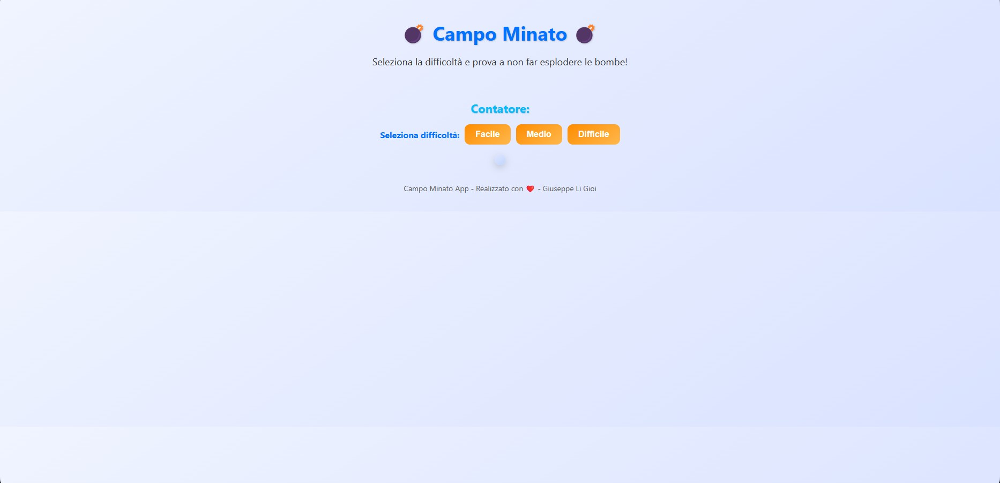

# 💣 Campo Minato

Un'applicazione web in JavaScript che riproduce il classico **Campo Minato**, con difficoltà selezionabili e sistema di punteggio.  
È stata aggiunta anche una funzione di **Best Time** che salva i tempi migliori per ogni livello utilizzando la memoria del browser (localStorage).

---

## 🎮 Funzionalità

- ✅ 3 modalità di difficoltà:
  - **Facile (10x10, 100 celle)**
  - **Medio (9x9, 81 celle)**
  - **Difficile (7x7, 49 celle)**
- ✅ Generazione casuale delle bombe ad ogni partita
- ✅ Contatore celle sicure cliccate
- ✅ Overlay finale con messaggi di vittoria o sconfitta
- ✅ Salvataggio del **miglior tempo per difficoltà** nel browser
- ✅ Layout responsive e interfaccia moderna con animazioni

---

## 📂 Struttura del progetto

```
campo-minato/
│
├── index.html        # Struttura della pagina
├── style.css         # Stili dell'app
├── main.js           # Logica del gioco
├── useStorage.js     # Gestione LocalStorage (salvataggio Best Time)
└── README.md         # Questo file
```

---

## 🚀 Come avviare il progetto

1. Clona o scarica questo repository
2. Apri `index.html` direttamente nel browser  
   *(non è richiesto nessun server o installazione di pacchetti)*

---

## ⏱️ Best Time

Il miglior tempo viene salvato automaticamente nel **LocalStorage** del browser per ogni difficoltà.  
Quando vinci:
- Se il tuo tempo è migliore di quello salvato → viene aggiornato
- Altrimenti → resta salvato il precedente

---


## 🛠️ Tecnologie usate

- **HTML5**
- **CSS3 (Flexbox & Animazioni)**
- **JavaScript (vanilla)**

---

## ✨ Possibili miglioramenti futuri

- Aggiungere **leaderboard globale** con più punteggi
- Modalità **timer countdown** invece che stop-watch
- Aggiungere **skin personalizzabili** per le celle
- Modalità **mobile-first** più ottimizzata

---

## Screenshot 📸

### Schermata iniziale


### Griglie di Gioco


### Output e visualizzazione sconfitta


### Output e visualizzazione vittoria


## 👨‍💻 Autore

Sviluppato da **Giuseppe Li Gioi** 💻  
Se ti piace il progetto lascia una ⭐ su GitHub!
